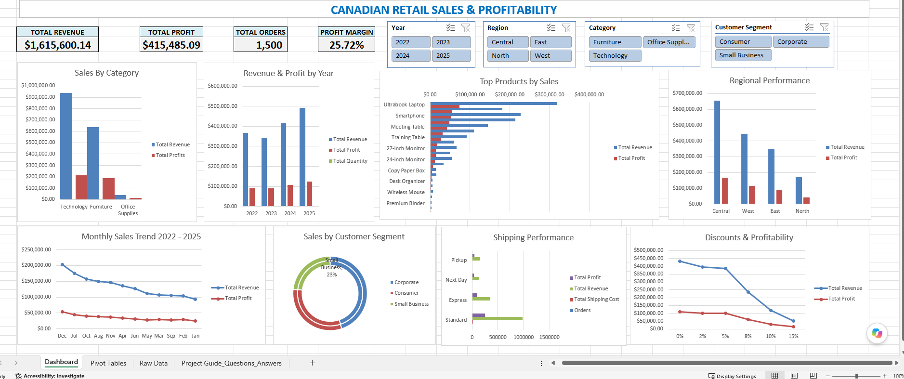
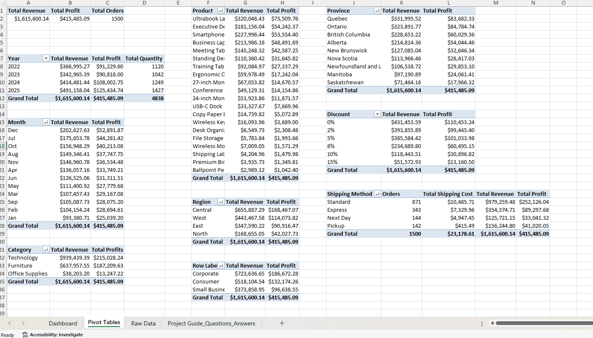
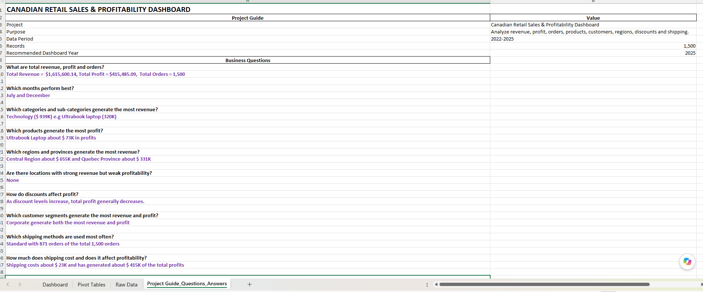
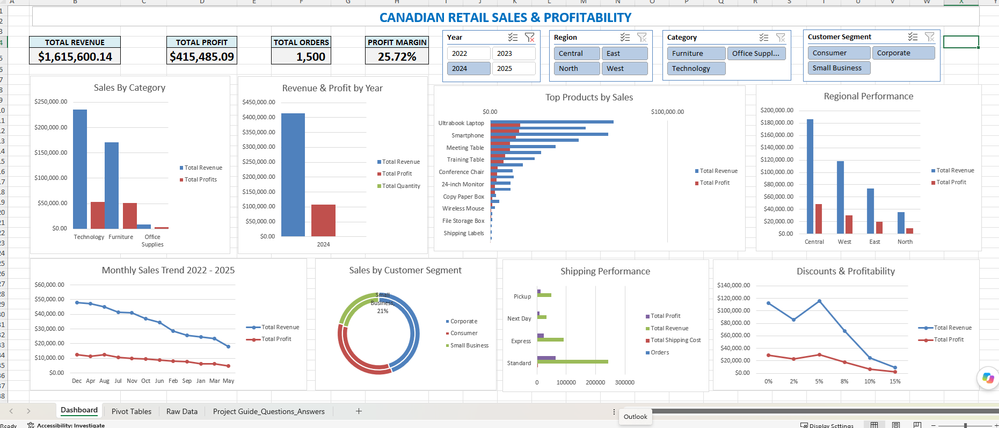

# Canadian Retail Sales & Profitability Analysis

## Project Overview

This project analyzes Canadian retail sales data from **2022–2025** using Microsoft Excel.

The goal was to turn raw sales data into an interactive dashboard and use data analysis to understand **sales performance, profitability, products, customers, regions, discounts, and shipping operations**.

## Business Questions

The analysis was designed to answer:

- What are the company's total sales, profit, orders, and profit margin?
- How have sales and profit changed from 2022–2025?
- Which months perform best?
- Which products and categories generate the most sales and profit?
- Which customer segments generate the most sales and profit?
- Which regions and provinces perform best?
- How do discounts affect profitability?
- Which shipping methods are used most often?
- Are there areas with strong sales but weaker profitability?
- Are customers purchasing larger or smaller quantities over time?

## Dashboard

The final dashboard includes:

- Revenue, Profit, Orders, and Profit Margin KPIs
- Sales and profit trends
- Product and category performance
- Regional and customer analysis
- Discount and shipping analysis
- Interactive slicers for **Year, Region, Category, and Customer Segment**

## Skills Tested & Used

- Data cleaning and validation
- Data organization
- PivotTables
- PivotCharts
- Slicers and interactive filtering
- KPI development
- Revenue and profit analysis
- Trend analysis
- Product and category analysis
- Customer segmentation
- Regional analysis
- Discount and profitability analysis
- Shipping analysis
- Dashboard design and data visualization
- Translating business questions into data analysis

## Tools

**Microsoft Excel**

- PivotTables
- PivotCharts
- Slicers
- Excel formulas
- Dashboard development
- Data visualization

## Project Files

- `Canadian_Retail_Sales_Dashboard_Project.xlsx` — Excel analysis and dashboard
- `01_Final_Dashboard.png` — Final dashboard
- `02_PivotTable_Analysis.png` — PivotTable analysis
- `03_Project_Guide_Business_Questions.png` — Project guide and business questions
- `04_Dashboard_2024_Filtered.png` — Interactive dashboard with 2024 selected

## Screenshots

### Final Dashboard

### PivotTable Analysis

### Business Questions

### Interactive Dashboard — 2024

